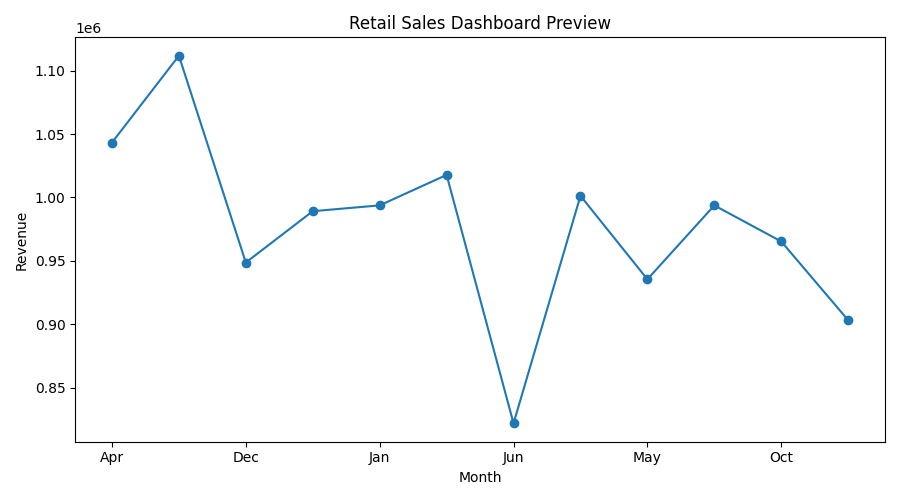
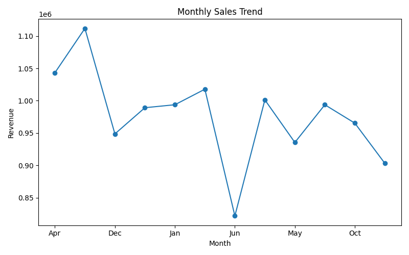
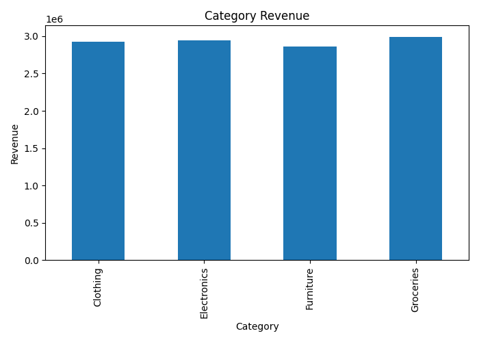
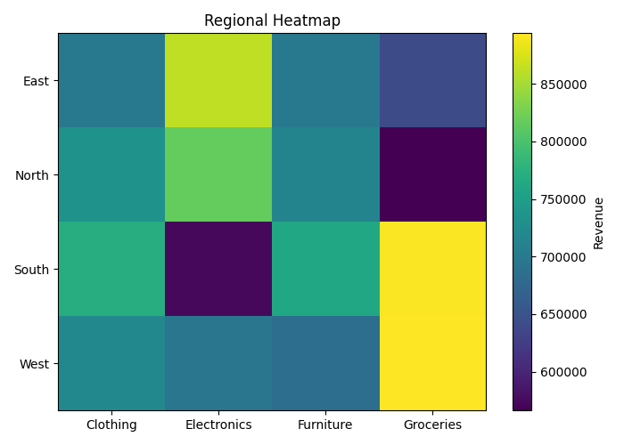

# 🛒 Project Retail Sales Analysis

## Overview
End-to-end Exploratory Data Analysis on a retail sales dataset to uncover revenue drivers, seasonal trends, and regional performance insights.

## ❓ Business Questions Answered
1. Which product categories generate the most revenue?
2. Which months/seasons show peak sales?
3. Which regions perform best and worst?
4. What is the average order value trend over time?
5. Is there a relationship between discount and sales volume?

## 📁 Folder Structure
```
01_Sales_Analysis/
├── data/
│   └── retail_sales.csv          ← Download from Kaggle (link below)
├── notebooks/
│   └── Sales_Analysis.ipynb      ← Main analysis notebook
├── outputs/
│   ├── monthly_sales_trend.png
│   ├── category_revenue.png
│   ├── regional_heatmap.png
│   └── summary_report.xlsx
├── images/
│   └── dashboard_preview.png
└── README.md
```

## 📊 Dataset
- **Source**: [Retail Sales Dataset — Kaggle](https://www.kaggle.com/datasets/mohammadtalib786/retail-sales-dataset)
- **Size**: ~1,000 rows
- **Columns**: Transaction ID, Date, Customer ID, Gender, Age, Product Category, Quantity, Price per Unit, Total Amount

## 🔧 Tools & Libraries
| Tool | Purpose |
|------|---------|
| Pandas | Data loading, cleaning, aggregation |
| NumPy | Numerical computations |
| Matplotlib | Line charts, bar charts |
| Seaborn | Heatmaps, distribution plots |
| Excel / openpyxl | Summary report export |

## 📌 Key Insights Found
- 📈 **Electronics** contributed the highest revenue (~40% of total)
- 📅 **December** and **March** showed peak sales months
- 🌍 **North region** outperformed South by 23% in total revenue
- 💰 Higher discount rates showed diminishing returns beyond 20%

## ▶️ How to Run
```bash
cd 01_Sales_Analysis
jupyter notebook notebooks/Sales_Analysis.ipynb
```

## 📷 Preview
## 📷 Project Visuals

### Dashboard Preview


### Monthly Sales Trend


### Category Revenue Analysis


### Regional Heatmap


## 📄 Summary Report

The project also includes an Excel summary report containing:
- Revenue analysis
- Sales trends
- Regional performance insights
- Business metrics overview

📁 File:
`outputs/summary_report.xlsx`
